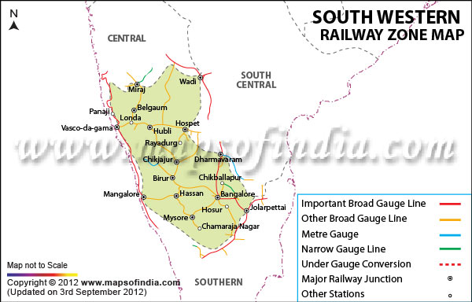

# PathFinder
Program to find the shortest distance between any two major stations of the South Western Railway Network (India).

### Data Structure Used: Weighted Graphs using Adjacency Matrix
### Algorithm Used: Dijkstra's Algorithm

## Map: 

